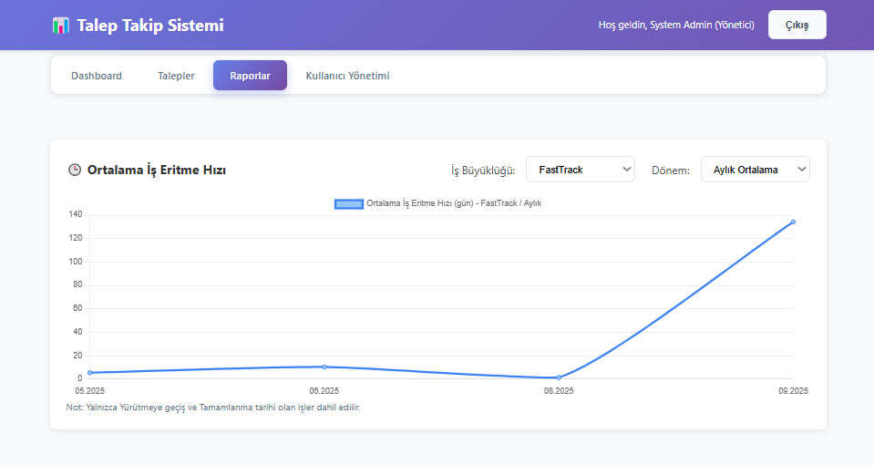

## Efor Takip Uygulaması

ASP.NET Core MVC (net8.0) ile geliştirilmiş basit ve pratik bir talep/efor takip uygulaması. JSON tabanlı dosya depolama kullanır, kullanıcı oturumlarını Session ile yönetir ve temel rol/yetki kontrolü içerir.

### Teknolojiler
- **.NET**: .NET 8 (ASP.NET Core MVC)
- **UI**: Razor Views, Bootstrap, jQuery
- **Kimlik Doğrulama**: Session tabanlı login
- **Şifreleme**: `BCrypt.Net-Next`
- **Depolama**: JSON dosyaları (`Data/requests.json`, `Data/users.json`)

### Başlıca Özellikler
- Talepler için oluşturma, görüntüleme, düzenleme, silme (CRUD)
- Durum yönetimi: Havuz, Yürütme, Tamamlandı, İptal
- Aktif işler görünümü ve deadline önceliklendirme
- Efor alanları: Analist, Yazılım, KKT, Preprod, Taşıma ve toplam saat; adam-gün hesaplama
- Dosya yükleme/indirme/silme (10MB limit, belirli uzantılar)
- Dashboard istatistikleri ve yaklaşan kritik işler
- Raporlama sayfası ve CSV/JSON dışa aktarma

---

## Kurulum

### Önkoşullar
- .NET 8 SDK
- (Opsiyonel) Visual Studio 2022 veya VS Code

### Adımlar
1. Depoyu klonlayın.
2. Proje kökünde aşağıdaki komutla derleyin:
```bash
dotnet build
```
3. Uygulamayı çalıştırın:
```bash
dotnet run --project EforTakipUygulamasi/EforTakipUygulamasi.csproj
```
4. Tarayıcıda açın: `https://localhost:7166` veya konsoldaki URL. Varsayılan rota `Auth/Login` sayfasını açar.

Visual Studio ile: `EforTakipUygulamasi.sln` dosyasını açıp F5 ile çalıştırabilirsiniz.

---

## Giriş ve Roller

### Varsayılan kullanıcılar
- **admin / admin123**: Yönetici (Admin)

Diğer örnek kullanıcılar `EforTakipUygulamasi/Data/users.json` içindedir. Bazı kayıtların parolaları BCrypt ile hash’lenmiştir.

### Roller ve yetkiler
- **Admin**: Tüm işlemler (oluştur, düzenle, durum değiştir, sil, dosya yönetimi)
- **Developer**: Oluştur, düzenle, durum değiştir, dosya yönetimi; silme yok
- **Viewer**: Sadece görüntüleme; oluşturma/düzenleme/silme/dosya işlemleri yok

Oturum anahtarları Session’da tutulur: `UserId`, `Username`, `FullName`, `UserRole`.

---

## Veri Depolama

Uygulama verileri dosya tabanlı JSON içinde saklanır:
- `EforTakipUygulamasi/Data/requests.json`: Talepler
- `EforTakipUygulamasi/Data/users.json`: Kullanıcılar

Üretim için kalıcı bir veritabanına (SQL Server, PostgreSQL vb.) geçiş önerilir.

---

## Dosya Yükleme

- Yüklemeler `wwwroot/uploads/{requestId}` altında tutulur.
- Boyut limiti: **10MB**
- Desteklenen uzantılar: `.doc`, `.docx`, `.pdf`, `.xls`, `.xlsx`, `.png`, `.jpg`, `.jpeg`, `.csv`
- İstemci tarafında Request detay sayfasından yüklenebilir/indirilebilir/silinebilir.

---

## Raporlama

- Rapor görünümü: `Report/Index`
- Tüm talepleri CSV veya JSON olarak dışa aktarma:
  - CSV: `GET /Report/ExportData?format=csv` → `efor_raporu_yyyyMMdd.csv`
  - JSON: `GET /Report/ExportData?format=json`

---

## Çalışma Zamanı Detayları

- Hedef Framework: `net8.0`
- Varsayılan rota: `{controller=Auth}/{action=Login}/{id?}`
- Session yapılandırması: 30 dk idle timeout, `EforTakip.Session` cookie
- Hata işleyici (prod): `/Auth/Login`

---

## Geliştirme

### Projeyi çalıştırma (komut satırı)
```bash
cd EforTakipUygulamasi
dotnet watch run
```

### Kullanıcı/Talep verilerini düzenleme
- `Data/users.json` ve `Data/requests.json` dosyalarını doğrudan düzenleyebilirsiniz.
- Admin parolası değiştirmek için `users.json` içindeki `PasswordHash` alanına düz metin (ör. `admin123`) veya BCrypt hash yazabilirsiniz. Uygulama her iki durumu da destekler.

---

## Dizin Yapısı (özet)
```
EforTakipUygulamasi/
  Common/           # Yardımcılar, sabitler, enumlar
  Controllers/      # MVC controller’lar (Auth, Request, Dashboard, Report)
  Data/             # JSON veri dosyaları ve repository sınıfları
  Models/           # Request, User, vb. model sınıfları
  Views/            # Razor View’lar
  wwwroot/          # Statik içerik ve uploads
  Program.cs        # Uygulama başlangıcı ve pipeline
  EforTakipUygulamasi.csproj
```

## Ekran Görüntüleri

Görselleri repoda tutmak için `docs/screenshots/` klasörüne ekleyin ve aşağıdaki adlarla kaydedin. README bu göreli yollarla görüntüleyecektir.

### Giriş ve Kullanıcı (4 adet)


### Talepler (5 adet)


### Rapor (1 adet)


### Dashboard (3 adet)


